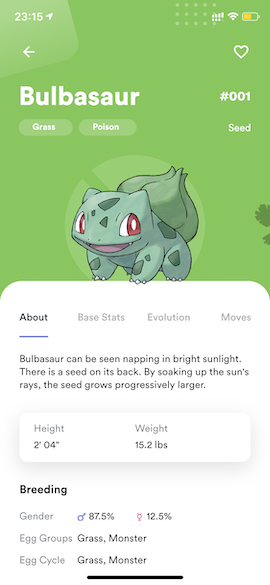
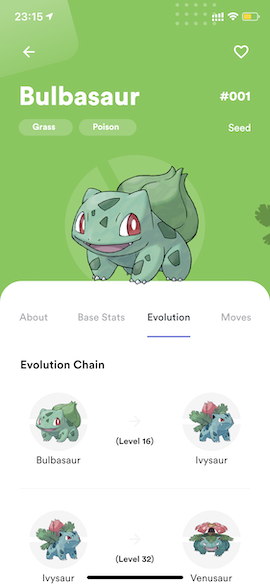

# Flutter Pokedex

Pokedex app built with Flutter

## App preview

")

## Video demo

https://www.youtube.com/watch?v=T0r_c68-eCg

## Installation

- Add [Flutter](https://flutter.dev/docs/get-started/install) to your machine

- Open this project folder with Terminal/CMD and run `flutter packages get`

- Run `flutter run` to build and run the debug app on your emulator/phone

## Todos

- [x] Home
- [x] Home - Apply Sliver effect in home screen
- [x] Pokedex
- [x] Pokedex - FAB
- [x] Pokedex - Add FAB animation
- [ ] Pokedex - Add grid loading animation
- [x] Pokedex - Add more Pokemons 
- [x] Pokedex - Add load more
- [x] Pokemon Info
- [x] Pokemon Info - About
- [x] Pokemon Info - Base Stats
- [x] Pokemon Info - Evolution
- [ ] Pokemon Info - Moves (no design)
- [x] Pokemon Info - Make tab area expandable
- [x] Pokemon Info - Add animations
- [x] Pokemon Info - Add more Pokemons 
- [ ] Pokemon Info - Add missing data in About tab
- [x] Pokemon Info - Add Base Stats 
- [x] Pokemon Info - Add Evolution 

